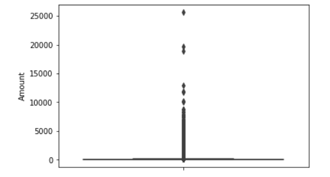
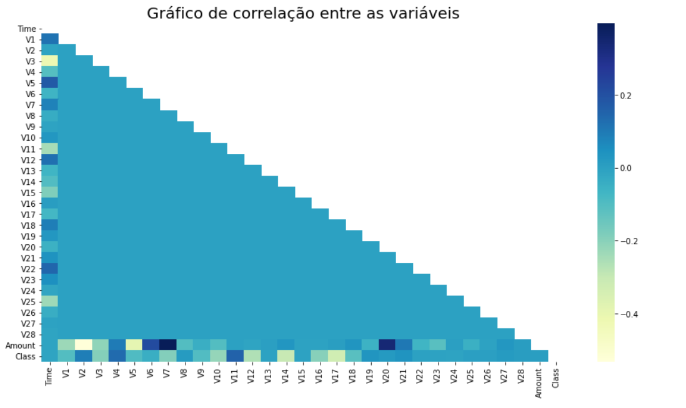
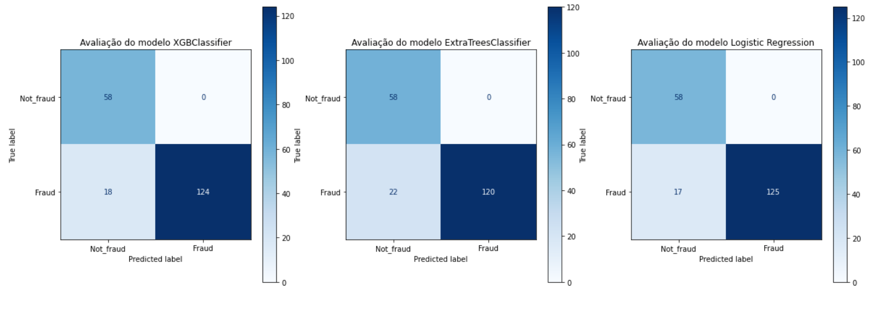

[](https://www.linkedin.com/in/matheus-meza-26956bb6) [](https://www.python.org/downloads/release/python-365/) [](http://perso.crans.org/besson/LICENSE.html) [](https://github.com/carlosfab/data_science/issues)

# Projeto: Credit Card Fraud Detection
 ### _Detecção de fraude em cartão de crédito_

<p align="center">
  
</p>

O pagamento com cartão de crédito obteve um aumento exponencial de utilização em decorrência de 3 principais pontos: 
- Tecnologia;
- Facilidade na obtenção;
- Maior variedade de empresas que disponibilizam esse método de pagamento em conjunto com empresas que aceitam o método de pagamento. 

Ao mesmo tempo, os fraudadores tendo essa visão de crescimento deste método de pagamento, começaram a impactar cada vez mais o mercado com a realização de fraude em pessoas inocentes. 
  
Devido este problema que tende a aumentar, é de suma importância que as empresas de cartão de crédito sejam capazes de reconhecer transações fraudulentas para que os clientes não sejam cobrados por itens que não compraram.
  
**A ideia deste projeto é trazer métodos de identificação de fraude em cartão de crédito com Machine Learning (Aprendizado de Máquina) com intuito de diminuir o nível de fraude.**

---

Para a obtenção dos dados, utilizei o [Kaggle](https://www.kaggle.com/mlg-ulb/creditcardfraud) pois trata-se de um site super rico, onde há diversos datasets para trabalharmos e tendo o problema que queremos resolver, aproveitamos o dataset de fraude em cartões de crédito.

Em relação aos próximos passos, precisamos importar uma série de bibliotecas para trabalharmos neste nootebook. Seguem as bibliotecas:

```
# Importando bibliotecas necessárias
import pandas as pd
import numpy as np
import matplotlib.pyplot as plt
import seaborn as sns

# pré-processamento
from sklearn.preprocessing import StandardScaler 
from imblearn.over_sampling import RandomOverSampler
from imblearn.under_sampling import RandomUnderSampler
from collections import Counter

# Modelagem
from sklearn.tree import DecisionTreeClassifier
from sklearn.neighbors import KNeighborsClassifier
from sklearn.ensemble import RandomForestClassifier
from sklearn.ensemble import ExtraTreesClassifier
from sklearn.linear_model import LogisticRegression
from sklearn.svm import LinearSVC
from lightgbm import LGBMClassifier
from xgboost import XGBClassifier
from xgboost import XGBRFClassifier

# Validação
from sklearn.model_selection import GridSearchCV
from sklearn.model_selection import train_test_split
from sklearn.model_selection import cross_val_score
from sklearn.metrics import roc_curve
from sklearn.metrics import roc_auc_score 
from sklearn.metrics import accuracy_score
from sklearn.metrics import f1_score
from sklearn.metrics import precision_score
from sklearn.metrics import recall_score
from sklearn.metrics import confusion_matrix
from sklearn.metrics import plot_confusion_matrix

```
Segue abaixo a linha de código utilizada para obter esses dados:
```
base = pd.read_csv('creditcard.csv')
```

---

Após a extração, verificamos cerca de **284.807 linhas** e **31 colunas**. Ao analisar as colunas detalhadamente, tivemos:
- `Time` - Número de segundos decorridos entre a transação atual e a primeira transação no conjunto de dados;
- `Colunas de "V1" até "V28"` - São features (características) dos usuários nas quais são resultados de um processo de PCA (Redução de dimensionalidade) para proteger a identidade e a sensibilidade dos dados.
- `Amount` - Valor em USD da transação;
- `Class` - Identificador se foi realmente fraude ou não.

Como trata-se de um dataset que possivelmente foi tratado, tendo em vista já veio com colunas que passaram por um processo de PCA, não teve dados nulos. Por outro lado, um ponto importante que ao decorrer das análises exploratórias, identificamos que a coluna `Amount` possui outliers que poderiam impactar em nossa modelagem e para que esse impacto não seja negativo no processo de modelagem, fizemos uma normalização com os dados dessa coluna, tentando deixar um pouco mais distribuído.

Segue abaixo um exemplo do gráfico de boxplot mostrando um pouco sobre a questão de outliers da variável `Amount`

<p align="center">
  
</p>

---

No processo de análise exploratória foi identificado um **ENORME desbalanceamento** na variável `Class` que é nossa variável target onde classifica transações que são fraudadulentas com o número 1 e os não-fraudadulentas com o número 0.
Enfatizo esse desbalanceamento porque do total de linhas 284.807, apenas 0.17% (492) são trasações fraudulentas e isso com certeza impacta em nosso modelo, nos trazendo grandes riscos de passarmos por um problema de OverFitting (Em resumo: Modelo muito ajustado aos dados que foi treinado, porém, não performa bem aos dados que não conhece).

Para diminuir esse risco de OverFitting, foi utilizado técnicas UnderSampling e OverSampling que basicamente ajudam nos ajustes de balanceamento.

Outro ponto na análise exploratória, criamos uma visualizacão para identificar a correlação entre as variáveis, pois isso nos ajuda a entender como as features estão se relacionando entre si:

<p align="center">
  
</p>

As variáveis que possuem redução de dimensionalidade não se relacionam entre si o que pode ser em decorrência do próprio PCA, entretanto, conseguimos ver algumas correlações um pouco interessantes entre essas variáveis e `Time`, `Amount` e `Class`.

A variável `Class` que é a nossa variável target, possui correlação com as variáveis:

- Correlação positiva com -> V4, V11
- Correlação negativa com -> V14, V17

A variável `Amount`, possui correlação com as variáveis:

- Correlação positiva com -> V6, V7, v20
- Correlação negativa com -> V2, V5

A variável `Time`, possui correlação com as variáveis:

- Correlação positiva com -> V5
- Correlação negativa com -> V3

---

No processo de modelagem, selecionamos alguns modelos mais utilizados nesse método de classificação e fizemos algumas análises entre eles, durante o processo, verificamos que para os dados não vistos, alguns modelos não estavam performando tão bem se comparado com os dados de treino e por isso, realizei alguns ajustes nas bases e procedimentos de UnderSampling e OverSampling e inclusive, antes da separação dos dados de treino e teste, por segurança, separei mais alguns dados aleatórios para teste também para nos ajudar a ter uma ideia mais real da utilização dos modelos.

Os modelos selecionados para as análises finais foram os `XGBClassifier`, `ExtraTreesClassifier` e `LogisticRegression`. Segue a matriz de confusão após ajustes de hiper-parâmetros:

<p align="center">
  
</p>

O modelo com melhor performance foi o Logistic Regression com:
- Acurácia: 91.5%
- Precisão: 100%
- Recall: 88%
- F1-Score: 93.6%

---

Considero um resultado positivo, levando em conta que nossa base de dados possui um enorme problema de desbalanceamento e para evitar isso tivemos que utilizar algumas técnicas de sobreajustes conforme está detalhado no script. Acredito que de todo este processo, temos oportunidades na questão do balanceamento dos dados, sugiro para próximos passos avaliar uma forma melhor de testar os dados, tendo em vista que pegamos uma amostra de teste pequena em comparação com todo o dataset.
